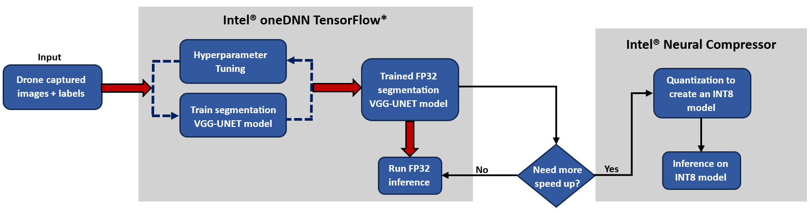

PROJECT NOT UNDER ACTIVE MANAGEMENT

This project will no longer be maintained by Intel.

Intel has ceased development and contributions including, but not limited to, maintenance, bug fixes, new releases, or updates, to this project.  

Intel no longer accepts patches to this project.

If you have an ongoing need to use this project, are interested in independently developing it, or would like to maintain patches for the open source software community, please create your own fork of this project.  

Contact: webadmin@linux.intel.com
# Drone Navigation Inspection

## Introduction
Build an optimized semantic segmentation solution based on the Visual Geometry Group (VGG)-UNET architecture and oriented to assist drones on safely landing by identifying and segmenting paved areas. The proposed system uses Intel® oneDNN optimized TensorFlow\* to accelerate the training and inference performance of drones equipped with Intel® hardware, whereas Intel® Neural Compressor is applied to compress the trained segmentation model to further increase speed up inference. Check out the [Developer Catalog](https://developer.intel.com/aireferenceimplementations) for information about different use cases.

## Solution Technical Overview
Drones are unmanned aerial vehicles (UAVs) or unmanned aircraft systems. Essentially, a drone is a flying robot that can be remotely controlled using remote control devices which communicate with the drone. While drones have huge applications in sectors like urban development, construction & infrastructure, supply chain and logistics use cases, safety is a huge concern.

Drones are used commercially as first-aid vehicles, as tools for investigation by police departments, in high-tech photography and as recording devices for real estate properties, concerts, sporting events, etc. This reference kit model has been built with the objective of improving the safety of autonomous drone flight and landing procedures at the edge (which runs on CPU based hardware) without ground-based controllers or human pilots onsite.

Drones at construction sites are used to scan, record, and map locations or buildings land surveys, tracking machines, remote monitoring, construction site security, building inspection, and worker safety. However, drone crashes are dangerous and can lead to devastation.

In utilities sector, inspecting growing numbers of towers, powerlines, and wind turbines is difficult and creates prime opportunities for drones to replace human inspection with accurate image-based inspection and diagnosis. Drones transform the way inspection and maintenance personnel do their jobs at utility companies. If a drone meets with an accident while landing, it could damage assets and injure personnel.

Safe landing of drones without injuring people or damaging property is vital for massive adoption of drones in day-to-day life. Considering the risks associated with drone landing, paved areas dedicated for drones to land are considered safe. The Artificial Intelligence (AI) system introduced in this project presents a deep learning model which segments paved areas for safe landing. Furthermore, the proposed solution allows an efficient deployment while maintaining the accuracy and speeding up the inference time by leveraging the following Intel® oneAPI packages:

* ***Intel® Distribution for Python\****

	The [Intel® Distribution for Python*](https://www.intel.com/content/www/us/en/developer/tools/oneapi/distribution-for-python.html) provides:

    * Scalable performance using all available CPU cores on laptops, desktops, and powerful servers
	  * Support for the latest CPU instructions
	  * Near-native performance through acceleration of core numerical and machine learning packages with libraries like the Intel® oneAPI Math Kernel Library (oneMKL) and Intel® oneAPI Data Analytics Library
	  * Productivity tools for compiling Python* code into optimized instructions
	  * Essential Python\* bindings for easing integration of Intel® native tools with your Python\* project

* ***[Intel® Optimizations for TensorFlow\*](https://www.intel.com/content/www/us/en/developer/tools/oneapi/optimization-for-tensorflow.html#gs.174f5y)***

    * Accelerate AI performance with Intel® oneAPI Deep Neural Network Library (oneDNN) features such as graph optimizations and memory pool allocation.
    * Automatically use Intel® Deep Learning Boost instruction set features to parallelize and accelerate AI workloads.
    * Reduce inference latency for models deployed using TensorFlow Serving.
    * Starting with TensorFlow 2.9, take advantage of oneDNN optimizations automatically.
    * Enable optimizations by setting the environment variable TF_ENABLE_ONEDNN_OPTS=1 in TensorFlow\* 2.5 through 2.8.

* ***Intel® Neural Compressor***

  [Intel® Neural Compressor](https://www.intel.com/content/www/us/en/developer/tools/oneapi/neural-compressor.html#gs.5vjr1p) performs model compression to reduce the model size and increase the speed of deep learning inference for deployment on CPUs or GPUs. This open source Python\* library automates popular model compression technologies, such as quantization, pruning, and knowledge distillation across multiple deep learning frameworks.

The use of AI in the context of drones can be further optimized using Intel® oneAPI which improves the performance of computing intensive image processing, reduces training/inference time and scales the usage of complex models by compressing models to run efficiently on edge devices. Intel® oneDNN optimized TensorFlow\* provides additional optimizations for an extra performance boost on Intel® CPU.

For more details, visit [Intel® Distribution for Python\*](https://www.intel.com/content/www/us/en/developer/tools/oneapi/distribution-for-python.html), [Intel® Optimizations for TensorFlow\*](https://www.intel.com/content/www/us/en/developer/tools/oneapi/optimization-for-tensorflow.html#gs.174f5y), [Intel® Neural Compressor](https://www.intel.com/content/www/us/en/developer/tools/oneapi/neural-compressor.html#gs.5vjr1p), and the [Drone Navigation Inspection](https://github.com/oneapi-src/drone-navigation-inspection) GitHub repository.

## Solution Technical Details
This reference kit leverages Intel® oneAPI to demonstrate the application of TensorFlow\* based AI models that works on drone technology to help segment paved areas which increases the probability of landing drones safely.

The experiment focus is drone navigation for inspections. Therefore, the experiment aims to segment the paved area and different objects around the drone path in order to land the drone safely on the paved area. The goal is therefore to take an image captured by the drone camera as input and pass it through the semantic segmentation model (VGG-UNET architecture) to accurately recognize entities, like paved area, people, vehicles or dogs, to then benchmark speed and accuracy of batch/real-time training and inference against Intel®’s technology. When it comes to the deployment of this model on edge devices with less computing and memory resources such as drones themselves, model is quantized and compressed while bringing out the same level of accuracy and efficient utilization of underlying computing resources. Model optimization and compression is done using Intel® Neural Compressor. 

### Dataset
Pixel-accurate annotation for drone dataset focuses on semantic understanding of urban scenes for increasing the safety of drone landing procedures. The imagery depicts more than 20 houses from nadir (bird's eye) view acquired at an altitude of 5 to 30 meters above ground. A high resolution camera was used to acquire images at a size of 6000x4000px (24Mpx). The complexity of the dataset is limited to 20 classes and the target output is paved area class. The training set contains 320  publicly available images, and the test set is made up of 80 images. Here the train & test dataset split is 80:20.

| **Use case** | Paved Area Segmentation
| :--- | :---
| **Object of interest** | Paved Area 
| **Size** | Total 400 Labelled Images<br>
| **Train : Test Split** | 80:20
| **Source** | https://www.kaggle.com/datasets/bulentsiyah/semantic-drone-dataset

Instructions on how to download and manage the dataset can be found in this [subsection](#download-the-dataset).

> *Please see this dataset's applicable license for terms and conditions. Intel® does not own the rights to this data set and does not confer any rights to it.*

## Validated Hardware Details
There are workflow-specific hardware and software setup requirements depending on
how the workflow is run. 

| Recommended Hardware                                            | Precision
| ----------------------------------------------------------------|-
| CPU: Intel® 2th Gen Xeon® Platinum 8280L CPU @ 2.70GHz or higher | FP32, INT8
| RAM: 187 GB                                                     |
| Recommended Free Disk Space: 20 GB or more                      |

Code was tested on Ubuntu\* 22.04 LTS.

## How it Works
The semantic segmentation pipeline presented in this reference kit enables the optimization of the training, hyperparameter tuning and inference modalities by using Intel® oneAPI specialized packages. The next diagram illustrates the workflow of these processes and how the Intel® optimization features are applied in each stage.



### Intel® oneDNN optimized TensorFlow\*
Training a convolutional neural network, like the VGG-UNET model used in this reference kit, and making inference with it, usually represent compute-intensive tasks. To address these requirements and to gain a performance boost on Intel® hardware, in this reference kit the training and inference stages include the implementation of TensorFlow\* optimized via Intel ®oneDNN.

Regarding the training step, the present solution allows to perform regular training and to undertake an exhaustive search of optimal hyperparameters by implementing a hyperparameter tuning scheme. 

In the case of the regular training of the VGG-UNET architecture, the efficiency of the process is increased by using transfer learning based on the pre-trained VGG encoder. Also, the machine learning practitioner can set different epochs values to assess the performance of multiple segmentation models. Please refer to this [subsection](#training-vgg-unet-model) to see how the regular training procedure is deployed.

The semantic segmentation model fitted through regular training can obtain a performance boost by implementing a hyperparameter tuning process using different values for `learning rate`, `optimizer` and `loss function`. In this reference kit, the hyperparameter search space is confined to the few hyperparameters listed in the next table: 

| **Hyperparameter** | Values
| :--- | :---
| **Learning rates** | [0.001, 0.01, 0.0001]<br>
| **Optimizers** | ["Adam", "adadelta", "rmsprop"]
| **Loss function** | ["categorical_crossentropy"]

As part of the hyperparameter tuning process, it is important to state that the dataset remains the same with 80:20 split for training and testing (see [here](#dataset) for more details about the dataset). Once the best combination of hyperparameters is defined, the model can be retrained with such combination to achieve better accuracy. The hyperparameter tuning execution is shown in this [subsection](#hyperparameter-tuning).

Another important aspect of the VGG-UNET model trained with Intel ®oneDNN optimized TensorFlow is that this model is trained using a FP32 precision.

### Intel® Neural Compressor
After training the VGG-UNET model using Intel® oneDNN optimized TensorFlow, its inference efficiency can be accelerated even more by the Intel® Neural Compressor library. This project enables the use of Intel® Neural Compressor to convert the trained FP32 VGG-UNET model into an INT8 CRNN model by implementing post-training quantization, which apart from reducing model size, increase the inference speed up.

The quantization of the trained FP32 VGG-UNET model into an INT8 CRNN model and other executed operations based on Intel® Neural Compressor optimizations can be inspected [here](#optimizations-with-intel-neural-compressor).

## Get Started
Start by **defining an environment variable** that will store the workspace path, this can be an existing directory or one to be created in further steps. This ENVVAR will be used for all the commands executed using absolute paths.

[//]: # (capture: baremetal)
```bash
export WORKSPACE=$PWD/drone-navigation-inspection
```

Also, it is necessary to define the following environment variables that will be used in later stages.

[//]: # (capture: baremetal)
```bash
export SRC_DIR=$WORKSPACE/src
export DATA_DIR=$WORKSPACE/data
export OUTPUT_DIR=$WORKSPACE/output
```

### Download the Workflow Repository
Create the workspace directory for the workflow and clone the [Drone Navigation Inspection]() repository inside it.

```bash
mkdir -p $WORKSPACE && cd $WORKSPACE
```

```bash
git clone https://github.com/oneapi-src/drone-navigation-inspection $WORKSPACE
```

Create the `$DATA_DIR` folder that will store the dataset in later steps.

[//]: # (capture: baremetal)
```bash
mkdir -p $DATA_DIR
```

### Set Up Conda
Please follow the instructions below to download and install Miniconda.

1. Download the required Miniconda installer for Linux.
   
   ```bash
   wget https://repo.anaconda.com/miniconda/Miniconda3-latest-Linux-x86_64.sh
   ```

2. Install Miniconda.
   
   ```bash
   bash Miniconda3-latest-Linux-x86_64.sh
   ```

3. Delete Miniconda installer.
   
   ```bash
   rm Miniconda3-latest-Linux-x86_64.sh
   ```

Please visit [Conda Installation on Linux](https://docs.anaconda.com/free/anaconda/install/linux/) for more details. 

### Set Up Environment
Execute the next commands to install and setup libmamba as conda's default solver.

```bash
conda install -n base conda-libmamba-solver
conda config --set solver libmamba
```

| Packages | Version | 
| -------- | ------- |
| intelpython3_core | 2024.1.0 |
| python | 3.9 |
| intelpython3_core | 2024.1.0 |
| intel-aikit-tensorflow | 2024.1 |
| tqdm | 4.66.2 |
| pip | 24.0 |
| opencv-python | 4.9.0.80 |

The dependencies required to properly execute this workflow can be found in the yml file [$WORKSPACE/env/intel_env.yml](env/intel_env.yml).

Proceed to create the conda environment.

```bash
conda env create -f $WORKSPACE/env/intel_env.yml
```

Environment setup is required only once. This step does not cleanup the existing environment with the same name hence we need to make sure there is no conda environment with the same name. During this setup, `drone_navigation_intel` conda environment will be created with the dependencies listed in the YAML configuration.

Activate the `drone_navigation_intel` conda environment as follows:

```bash
conda activate drone_navigation_intel
```

### Download the Dataset
Please follow the next instructions to correctly download and setup the dataset required for this semantic segmentation workload.

1. Install [Kaggle\* API](https://github.com/Kaggle/kaggle-api) and configure your [credentials](https://github.com/Kaggle/kaggle-api#api-credentials) and [proxies](https://github.com/Kaggle/kaggle-api#set-a-configuration-value).

2. Navigate inside the `data` folder and download the dataset from https://www.kaggle.com/datasets/bulentsiyah/semantic-drone-dataset.

   ```bash
   cd $DATA_DIR
   kaggle datasets download -d bulentsiyah/semantic-drone-dataset
   ```

3. Unzip the dataset file.

   ```bash
   unzip semantic-drone-dataset.zip
   ```

4. Move the dataset and the image masks into a proper locations.

   ```bash
   mkdir Aerial_Semantic_Segmentation_Drone_Dataset
   mv  ./dataset ./Aerial_Semantic_Segmentation_Drone_Dataset
   mv ./RGB_color_image_masks ./Aerial_Semantic_Segmentation_Drone_Dataset
   ```

After completing the previous steps, the `data` folder should have the below structure:

```
- Aerial_Semantic_Segmentation_Drone_Dataset
    - dataset
        - semantic_drone_dataset
            - label_images_semantic
            - original_images
    - RGB_color_image_masks
```

## Supported Runtime Environment
The execution of this reference kit is compatible with the following environments:
* Bare Metal

### Run Using Bare Metal

#### Set Up System Software

Our examples use the `conda` package and environment on your local computer. If you don't already have `conda` installed or the `conda` environment created, go to [Set Up Conda*](#set-up-conda) or see the [Conda* Linux installation instructions](https://docs.conda.io/projects/conda/en/stable/user-guide/install/linux.html).

> *Note: It is assumed that the present working directory is the root directory of this code repository. Use the following command to go to the root directory.*

```bash
cd $WORKSPACE
```

### Run Workflow
The following subsections provide the commands to make an optimized execution of this semantic segmentation workflow based on Intel® oneDNN optimized TensorFlow\* and Intel® Neural Compressor. As an illustrative guideline to understand how the Intel® specialized packages are used to optimize the performance of the VGG-UNET semantic segmentation model, please check the [How it Works section](#how-it-works).

### Optimizations with Intel® oneDNN TensorFlow\*
Based on TensorFlow\* optimized by Intel® oneDNN, the stages of training, hyperparameter tuning, conversion to frozen graph, inference and evaluation are executed below. 

### Training VGG-UNET Model 
The Python\* script given below needs to be executed to start training the VGG-UNET. For more details about the training process, see this [subsection](#intel®-onednn-optimized-tensorflow). About the training data, please check this [subsection](#dataset).

```
usage: training.py [-h] [-m MODEL_PATH] -d DATA_PATH [-e EPOCHS] [-hy HYPERPARAMS]

optional arguments:
  -h, --help            show this help message and exit.
  -m MODEL_PATH, --model_path MODEL_PATH
                        Please provide the Latest Checkpoint path. Default is None.
  -d DATA_PATH, --data_path DATA_PATH
                        Absolute path to the dataset folder containing "original_images" and "label_images_semantic" folders. 
  -e EPOCHS, --epochs EPOCHS
                        Provide the number of epochs want to train.
  -hy HYPERPARAMS, --hyperparams HYPERPARAMS
                        Enable hyperparameter tuning. Default is "0" to indicate unabled hyperparameter tuning.
```

Example:

[//]: # (capture: baremetal)
```bash
python $SRC_DIR/training.py -d $DATA_DIR/Aerial_Semantic_Segmentation_Drone_Dataset/dataset/semantic_drone_dataset -e 10 -m $OUTPUT_DIR/model
```

In this example, Intel® oneDNN optimized TensorFlow\* is applied to boost training performance and the generated TensorFlow\* checkpoint model will be saved in the `$OUTPUT_DIR/model` folder.

### Hyperparameter Tuning 
The Python\* script given below needs to be executed to start hyperparameter tuned training. The model generated using the regular training approach will be regard as the pretrained model in which the fine tuning process will be applied. To obtain more details about the hyperparameter tuning modality, refer to this [subsection](#intel®-onednn-optimized-tensorflow).

[//]: # (capture: baremetal)
```bash
python $SRC_DIR/training.py -d $DATA_DIR/Aerial_Semantic_Segmentation_Drone_Dataset/dataset/semantic_drone_dataset -e 3 -m $OUTPUT_DIR/model -hy 1 
```

> **Note**: **The best combinations of hyperparameters will get printed at the end of the script. The model can be retrained for a longer time (more number of epochs) with the best combination of hyperparameters to achieve a better accuracy.**

### Convert the Model to Frozen Graph
Run the Python\* conversion script given below to convert the TensorFlow\* checkpoint model format to frozen graph format. This frozen graph can be later used when performing inference with Intel® Neural Compressor.

```
usage: create_frozen_graph.py [-h] [-m MODEL_PATH] -o OUTPUT_SAVED_DIR

optional arguments:
  -h, --help            show this help message and exit.
  -m MODEL_PATH, --model_path MODEL_PATH
                        Please provide the Latest Checkpoint path. Default is None.
  -o OUTPUT_SAVED_DIR, --output_saved_dir OUTPUT_SAVED_DIR
                        Directory to save frozen graph to.

```

Example:

[//]: # (capture: baremetal)
```bash
python $SRC_DIR/create_frozen_graph.py -m $OUTPUT_DIR/model/vgg_unet --output_saved_dir $OUTPUT_DIR/model
```

In this example, the generated frozen graph will be saved in the `$OUTPUT_DIR/model` folder with the name `frozen_graph.pb`.

### Inference

The Python\* script given below needs to be executed to perform inference based on the segmentation model converted into frozen graph.

```
usage: run_inference.py [-h] [-m MODELPATH] -d DATA_PATH [-b BATCHSIZE]

optional arguments:
  -h, --help            show this help message and exit.
  -m MODELPATH, --modelpath MODELPATH
                        Provide frozen Model path ".pb" file. Users can also use Intel® Neural Compressor INT8 quantized model here. 
  -d DATA_PATH, --data_path DATA_PATH
                        Absolute path to the dataset folder containing "original_images" and "label_images_semantic" folders. 
  -b BATCHSIZE, --batchsize BATCHSIZE
                        batchsize used for inference.
```

Example:
-
[//]: # (capture: baremetal)
```bash
python $SRC_DIR/run_inference.py -m $OUTPUT_DIR/model/frozen_graph.pb -d $DATA_DIR/Aerial_Semantic_Segmentation_Drone_Dataset/dataset/semantic_drone_dataset -b 1
```

> Above inference script can be run using different batch sizes<br>
Same script can be used to benchmark Intel® Neural Compressor INT8 quantized model. For more details please refer to Intel® Neural Compressor quantization section.<br>
By using different batchsize one can observe the gain obtained using Intel® oneDNN optimized TensorFlow.<br>
Run this script to record multiple trials and the average can be calculated.

### Evaluating the Model on Test Dataset
Run the Python\* script given below to evaluate the semantic segmentation model and find out the class-wise accuracy score.

```
usage: evaluation.py [-h] [-m MODEL_PATH] -d DATA_PATH [-t MODEL_TYPE]

optional arguments:
  -h, --help            Show this help message and exit
  -m MODEL_PATH, --model_path MODEL_PATH
                        Please provide the Latest Checkpoint path. Default is None.
  -d DATA_PATH, --data_path DATA_PATH
                        Absolute path to the dataset folder containing "original_images" and "label_images_semantic" folders. 
  -t MODEL_TYPE, --model_type MODEL_TYPE
                        0 for checkpoint, 1 for frozen_graph.
```

Example to run evaluation using the original TensorFlow checkpoint model:

[//]: # (capture: baremetal)
```bash
python $SRC_DIR/evaluation.py -d $DATA_DIR/Aerial_Semantic_Segmentation_Drone_Dataset/dataset/semantic_drone_dataset -m $OUTPUT_DIR/model/vgg_unet -t 0   
```

Example to run evaluation using the frozen graph:

[//]: # (capture: baremetal)
```bash
python $SRC_DIR/evaluation.py -d $DATA_DIR/Aerial_Semantic_Segmentation_Drone_Dataset/dataset/semantic_drone_dataset -m $OUTPUT_DIR/model/frozen_graph.pb  -t 1  
```

> Same script can be used for Evaluating Intel® Neural Compressor INT8 quantized model. For more details please refer to Intel® Neural Compressor quantization section.<br>

### Optimizations with Intel® Neural Compressor
Intel® Neural Compressor is used to quantize the FP32 VGG-UNET model into a INT8 model. In this case, we used post training quantization method to quantize the FP32 model.

### Conversion of FP32 VGG-UNET Model to INT8 Model
Run the Python\* script given below to convert the FP32 VGG-UNET model in the form of the frozen graph into a INT8 model.

```
usage: neural_compressor_conversion.py [-h] -m MODELPATH -o OUTPATH [-c CONFIG] -d DATA_PATH [-b BATCHSIZE]

optional arguments:
  -h, --help            show this help message and exit.
  -m MODELPATH, --modelpath MODELPATH
                        Path to the model trained with TensorFlow and saved as a ".pb" file.
  -o OUTPATH, --outpath OUTPATH
                        Directory to save the INT8 quantized model to.
  -c CONFIG, --config CONFIG
                        Yaml file for quantizing model, default is "$SRC_DIR/intel_neural_compressor/deploy.yaml".
  -d DATA_PATH, --data_path DATA_PATH
                        Absolute path to the dataset folder containing "original_images" and "label_images_semantic" folders.
  -b BATCHSIZE, --batchsize BATCHSIZE
                        batchsize for the dataloader. Default is 1.
```

[//]: # (capture: baremetal)
```bash
python $SRC_DIR/intel_neural_compressor/neural_compressor_conversion.py -d $DATA_DIR/Aerial_Semantic_Segmentation_Drone_Dataset/dataset/semantic_drone_dataset -m  $OUTPUT_DIR/model/frozen_graph.pb -o  $OUTPUT_DIR/model/inc_compressed_model/output  
```

The model after conversion, that is the quantized model, will be stored in the `$OUTPUT_DIR/model/inc_compressed_model/` folder with the name `output.pb`.

### Inference Using Quantized INT8 VGG-UNET Model
The Python\* script given below needs to be executed to perform inference based on the quantized INT8 VGG-UNET Model.

```
usage: run_inference.py [-h] [-m MODELPATH] [-d DATA_PATH] [-b BATCHSIZE]

optional arguments:
  -h, --help            show this help message and exit.
  -m MODELPATH, --modelpath MODELPATH
                        Provide frozen Model path ".pb" file .Users can also use Intel® Neural Compressor INT8 quantized model here. Default is $OUTPUT_DIR/model/frozen_graph.pb
  -d DATA_PATH, --data_path DATA_PATH
                        Absolute path to the dataset folder containing "original_images" and "label_images_semantic" folders. Default is $DATA_DIR/Aerial_Semantic_Segmentation_Drone_Dataset/dataset/semantic_drone_dataset
  -b BATCHSIZE, --batchsize BATCHSIZE
                        batchsize used for inference.
```

Example:

[//]: # (capture: baremetal)
```bash
python $SRC_DIR/run_inference.py -m $OUTPUT_DIR/model/inc_compressed_model/output.pb -d $DATA_DIR/Aerial_Semantic_Segmentation_Drone_Dataset/dataset/semantic_drone_dataset  -b 1
```

> Use `-b` to test with different batch size (e.g. `-b 10`)

### Evaluating the Quantized INT8 VGG-UNET Model on Test Dataset
Run the Python\* script given below to evaluate the quantized INT8 VGG-UNET model and find out the class-wise accuracy score.

```
usage: evaluation.py [-h] [-m MODEL_PATH] [-d DATA_PATH] [-t MODEL_TYPE]

optional arguments:
  -h, --help            Show this help message and exit
  -m MODEL_PATH, --model_path MODEL_PATH
                        Please provide the Latest Checkpoint path. Default is None.
  -d DATA_PATH, --data_path DATA_PATH
                        Absolute path to the dataset folder containing "original_images" and "label_images_semantic" folders. 
  -t MODEL_TYPE, --model_type MODEL_TYPE
                        0 for checkpoint, 1 for frozen_graph.
```

Example to run evaluation using the frozen graph:

[//]: # (capture: baremetal)
```bash
python $SRC_DIR/evaluation.py -d $DATA_DIR/Aerial_Semantic_Segmentation_Drone_Dataset/dataset/semantic_drone_dataset -m $OUTPUT_DIR/model/inc_compressed_model/output.pb  -t 1  
```

#### Clean Up Bare Metal
The next commands are useful to remove the previously generated conda environment, as well as the dataset and the multiple models and files created during the workflow execution. Before proceeding with the clean up process, it is recommended to back up the data you want to preserve.

```bash
conda deactivate #Run this line if the drone_navigation_intel environment is still active
conda env remove -n drone_navigation_intel
rm -rf $WORKSPACE
```

---

### Expected Output
A successful execution of the different stages of this workflow should produce outputs similar to the following:

#### Regular Training Output with Intel® oneDNN optimized TensorFlow\*

```
2023-12-07 06:53:46.349193: I tensorflow/core/util/port.cc:111] oneDNN custom operations are on. You may see slightly different numerical results due to floating-point round-off errors from different computation orders. To turn them off, set the environment variable `TF_ENABLE_ONEDNN_OPTS=0`.
2023-12-07 06:53:46.379141: I tensorflow/core/platform/cpu_feature_guard.cc:182] This TensorFlow binary is optimized to use available CPU instructions in performance-critical operations.
To enable the following instructions: SSE3 SSE4.1 SSE4.2 AVX AVX2 AVX512F AVX512_VNNI FMA, in other operations, rebuild TensorFlow with the appropriate compiler flags.
Started data validation and Training for  10  epochs
Model Input height , Model Input width, Model Output Height, Model Output Width
416 608 208 304
Batch Size used for Training -->  4
Batch Size used for Validation -->  4
```
...
```
Starting Epoch  5
128/128 [==============================] - 298s 2s/step - loss: 1.0430 - accuracy: 0.6553
saved  //drone-navigation-inspection/output/model/vgg_unet
Finished Epoch 5
Starting Epoch  6
128/128 [==============================] - 298s 2s/step - loss: 1.0443 - accuracy: 0.6564
saved  //drone-navigation-inspection/output/model/vgg_unet
Finished Epoch 6
Starting Epoch  7
128/128 [==============================] - 297s 2s/step - loss: 1.0667 - accuracy: 0.6519
saved  //drone-navigation-inspection/output/model/vgg_unet
Finished Epoch 7
Starting Epoch  8
128/128 [==============================] - 298s 2s/step - loss: 1.0777 - accuracy: 0.6458
saved  //drone-navigation-inspection/output/model/vgg_unet
Finished Epoch 8
Starting Epoch  9
128/128 [==============================] - 297s 2s/step - loss: 1.0888 - accuracy: 0.6441
saved  //drone-navigation-inspection/output/model/vgg_unet
Finished Epoch 9
Time Taken for Training in seconds -->  3034.8698456287384
```

#### Hyperparameter Tuning Output with Intel® oneDNN optimized TensorFlow\*

```
2023-12-07 12:11:35.758937: I tensorflow/core/util/port.cc:111] oneDNN custom operations are on. You may see slightly different numerical results due to floating-point round-off errors from different computation orders. To turn them off, set the environment variable `TF_ENABLE_ONEDNN_OPTS=0`.
2023-12-07 12:11:35.789043: I tensorflow/core/platform/cpu_feature_guard.cc:182] This TensorFlow binary is optimized to use available CPU instructions in performance-critical operations.
To enable the following instructions: SSE3 SSE4.1 SSE4.2 AVX AVX2 AVX512F AVX512_VNNI FMA, in other operations, rebuild TensorFlow with the appropriate compiler flags.
Started Hyperprameter tuning
Model Input height , Model Input width, Model Output Height, Model Output Width
416 608 208 304
Batch Size used for Training -->  4
Total number of fits =  9
Take Break!!!
This will take time!
Loading weights from  //drone-navigation-inspection/output/model/vgg_unet
Current fit is at  1
Current fit parameters --> epochs= 3  learning rate= 0.001  optimizer= Adam  loss= categorical_crossentropy
/drone-navigation-inspection/src/utils.py:542: UserWarning: `Model.fit_generator` is deprecated and will be removed in a future version. Please use `Model.fit`, which supports generators.
  hist=model.fit_generator(train_gen, steps_per_epoch, epochs=epochs, workers=1, use_multiprocessing=False)
80% of Data is considered for Training ===>  320
```
...
```
Current fit is at  7
Current fit parameters --> epochs= 3  learning rate= 0.0001  optimizer= Adam  loss= categorical_crossentropy
Epoch 1/3
32/32 [==============================] - 76s 2s/step - loss: 0.9938 - accuracy: 0.6624 - mae: 0.0451 - mean_io_u_6: 0.4771
Epoch 2/3
32/32 [==============================] - 75s 2s/step - loss: 0.9846 - accuracy: 0.6790 - mae: 0.0444 - mean_io_u_6: 0.4770
Epoch 3/3
32/32 [==============================] - 75s 2s/step - loss: 0.9586 - accuracy: 0.6818 - mae: 0.0446 - mean_io_u_6: 0.4771
Fit number:  7  ==> Time Taken for Training in seconds -->  230.05844235420227
The best Tuningparameter combination is : {'accuracy': 0.6624360680580139, 'best_fit': (0.0001, 'Adam', 'categorical_crossentropy')}
Loading weights from  //drone-navigation-inspection/output/model/vgg_unet
Current fit is at  8
Current fit parameters --> epochs= 3  learning rate= 0.0001  optimizer= adadelta  loss= categorical_crossentropy
Epoch 1/3
32/32 [==============================] - 76s 2s/step - loss: 1.0724 - accuracy: 0.6356 - mae: 0.0461 - mean_io_u_7: 0.4771
Epoch 2/3
32/32 [==============================] - 75s 2s/step - loss: 1.0755 - accuracy: 0.6294 - mae: 0.0465 - mean_io_u_7: 0.4771
Epoch 3/3
32/32 [==============================] - 76s 2s/step - loss: 1.0776 - accuracy: 0.6274 - mae: 0.0466 - mean_io_u_7: 0.4771
Fit number:  8  ==> Time Taken for Training in seconds -->  230.5231795310974
The best Tuningparameter combination is : {'accuracy': 0.6624360680580139, 'best_fit': (0.0001, 'Adam', 'categorical_crossentropy')}
Loading weights from  //drone-navigation-inspection/output/model/vgg_unet
Current fit is at  9
Current fit parameters --> epochs= 3  learning rate= 0.0001  optimizer= rmsprop  loss= categorical_crossentropy
Epoch 1/3
32/32 [==============================] - 75s 2s/step - loss: 1.0011 - accuracy: 0.6676 - mae: 0.0449 - mean_io_u_8: 0.4770
Epoch 2/3
32/32 [==============================] - 75s 2s/step - loss: 0.9739 - accuracy: 0.6791 - mae: 0.0451 - mean_io_u_8: 0.4771
Epoch 3/3
32/32 [==============================] - 75s 2s/step - loss: 0.9588 - accuracy: 0.6840 - mae: 0.0440 - mean_io_u_8: 0.4771
Fit number:  9  ==> Time Taken for Training in seconds -->  229.0527949333191
The best Tuningparameter combination is : {'accuracy': 0.6676027774810791, 'best_fit': (0.0001, 'rmsprop', 'categorical_crossentropy')}
Time Taken for Total Hyper parameter Tuning and Model loading in seconds -->  2080.2837102413177
total_time -->  2079.7287237644196
```

#### Inference Output with Intel® oneDNN optimized TensorFlow\*

```
2023-12-07 13:09:59.528826: I tensorflow/core/util/port.cc:111] oneDNN custom operations are on. You may see slightly different numerical results due to floating-point round-off errors from different computation orders. To turn them off, set the environment variable `TF_ENABLE_ONEDNN_OPTS=0`.
2023-12-07 13:09:59.558645: I tensorflow/core/platform/cpu_feature_guard.cc:182] This TensorFlow binary is optimized to use available CPU instructions in performance-critical operations.
To enable the following instructions: SSE3 SSE4.1 SSE4.2 AVX AVX2 AVX512F AVX512_VNNI FMA, in other operations, rebuild TensorFlow with the appropriate compiler flags.
load graph
```
...
```
Time Taken for model inference in seconds --->  0.05593061447143555
Time Taken for model inference in seconds --->  0.05590033531188965
Time Taken for model inference in seconds --->  0.055976152420043945
Time Taken for model inference in seconds --->  0.0559389591217041
Time Taken for model inference in seconds --->  0.055884599685668945
Time Taken for model inference in seconds --->  0.05602383613586426
Time Taken for model inference in seconds --->  0.0559384822845459
Time Taken for model inference in seconds --->  0.055918216705322266
Time Taken for model inference in seconds --->  0.05595517158508301
Time Taken for model inference in seconds --->  0.05599474906921387
Average Time Taken for model inference in seconds --->  0.05594611167907715
```

#### Evaluation Output with Intel® oneDNN optimized TensorFlow\*
Output using the original TensorFlow checkpoint model:

```
2023-12-07 13:18:49.975518: I tensorflow/core/util/port.cc:111] oneDNN custom operations are on. You may see slightly different numerical results due to floating-point round-off errors from different computation orders. To turn them off, set the environment variable `TF_ENABLE_ONEDNN_OPTS=0`.
2023-12-07 13:18:50.004278: I tensorflow/core/platform/cpu_feature_guard.cc:182] This TensorFlow binary is optimized to use available CPU instructions in performance-critical operations.
To enable the following instructions: SSE3 SSE4.1 SSE4.2 AVX AVX2 AVX512F AVX512_VNNI FMA, in other operations, rebuild TensorFlow with the appropriate compiler flags.
```
...
```
[TARGET CLASS] paved-area =>  64.86
dirt =>  19.10
grass =>  58.54
gravel =>  12.78
water =>  12.97
rocks =>  0.09
pool =>  33.43
vegetation =>  33.72
roof =>  49.62
wall =>  2.15
window =>  0.00
door =>  0.00
fence =>  0.00
fence-pole =>  0.34
person =>  12.24
dog =>  0.00
car =>  9.96
bicycle =>  1.97
tree =>  3.10
bald-tree =>  0.00
Time Taken for Prediction in seconds -->  0.7498071193695068
```

Output using the frozen graph:

```
2023-12-07 13:26:49.874614: I tensorflow/core/util/port.cc:111] oneDNN custom operations are on. You may see slightly different numerical results due to floating-point round-off errors from different computation orders. To turn them off, set the environment variable `TF_ENABLE_ONEDNN_OPTS=0`.
2023-12-07 13:26:49.903073: I tensorflow/core/platform/cpu_feature_guard.cc:182] This TensorFlow binary is optimized to use available CPU instructions in performance-critical operations.
To enable the following instructions: SSE3 SSE4.1 SSE4.2 AVX AVX2 AVX512F AVX512_VNNI FMA, in other operations, rebuild TensorFlow with the appropriate compiler flags.
```
...
```
[TARGET CLASS] paved-area =>  67.84
dirt =>  20.96
grass =>  47.30
gravel =>  33.26
water =>  9.31
rocks =>  0.11
pool =>  43.17
vegetation =>  32.72
roof =>  25.90
wall =>  3.51
window =>  0.00
door =>  0.00
fence =>  0.00
fence-pole =>  0.00
person =>  5.84
dog =>  0.00
car =>  0.00
bicycle =>  0.04
tree =>  0.15
bald-tree =>  0.01
```

#### Expected Output for Conversion of FP32 VGG-UNET Model to INT8 Model Using Intel® Neural Compressor

```
2023-12-07 13:30:13.110902: I tensorflow/core/util/port.cc:111] oneDNN custom operations are on. You may see slightly different numerical results due to floating-point round-off errors from different computation orders. To turn them off, set the environment variable `TF_ENABLE_ONEDNN_OPTS=0`.
2023-12-07 13:30:13.140783: I tensorflow/core/platform/cpu_feature_guard.cc:182] This TensorFlow binary is optimized to use available CPU instructions in performance-critical operations.
To enable the following instructions: SSE3 SSE4.1 SSE4.2 AVX AVX2 AVX512F AVX512_VNNI FMA, in other operations, rebuild TensorFlow with the appropriate compiler flags.
```
...
```
2023-12-07 13:31:02 [INFO] |****Mixed Precision Statistics****|
2023-12-07 13:31:02 [INFO] +------------+-------+------+------+
2023-12-07 13:31:02 [INFO] |  Op Type   | Total | INT8 | FP32 |
2023-12-07 13:31:02 [INFO] +------------+-------+------+------+
2023-12-07 13:31:02 [INFO] |  ConcatV2  |   3   |  0   |  3   |
2023-12-07 13:31:02 [INFO] |   Conv2D   |   15  |  15  |  0   |
2023-12-07 13:31:02 [INFO] |  MaxPool   |   4   |  4   |  0   |
2023-12-07 13:31:02 [INFO] | QuantizeV2 |   5   |  5   |  0   |
2023-12-07 13:31:02 [INFO] | Dequantize |   8   |  8   |  0   |
2023-12-07 13:31:02 [INFO] +------------+-------+------+------+
2023-12-07 13:31:02 [INFO] Pass quantize model elapsed time: 4136.69 ms
Model Input height , Model Input width, Model Output Height, Model Output Width
416 608 208 304
20% of Data is considered for Evaluating===>  80
80it [00:36,  2.18it/s]
2023-12-07 13:31:39 [INFO] Tune 1 result is: [Accuracy (int8|fp32): 0.6624|0.6784, Duration (seconds) (int8|fp32): 36.7283|38.3752], Best tune result is: [Accuracy: 0.6624, Duration (seconds): 36.7283]
2023-12-07 13:31:39 [INFO] |**********************Tune Result Statistics**********************|
2023-12-07 13:31:39 [INFO] +--------------------+----------+---------------+------------------+
2023-12-07 13:31:39 [INFO] |     Info Type      | Baseline | Tune 1 result | Best tune result |
2023-12-07 13:31:39 [INFO] +--------------------+----------+---------------+------------------+
2023-12-07 13:31:39 [INFO] |      Accuracy      | 0.6784   |    0.6624     |     0.6624       |
2023-12-07 13:31:39 [INFO] | Duration (seconds) | 38.3752  |    36.7283    |     36.7283      |
2023-12-07 13:31:39 [INFO] +--------------------+----------+---------------+------------------+
2023-12-07 13:31:39 [INFO] Save tuning history to /drone-navigation-inspection/src/intel_neural_compressor/nc_workspace/2023-12-07_13-30-16/./history.snapshot.
2023-12-07 13:31:39 [INFO] Specified timeout or max trials is reached! Found a quantized model which meet accuracy goal. Exit.
2023-12-07 13:31:39 [INFO] Save deploy yaml to /drone-navigation-inspection/src/intel_neural_compressor/nc_workspace/2023-12-07_13-30-16/deploy.yaml
2023-12-07 13:31:39 [INFO] Save quantized model to //drone-navigation-inspection/output/model/inc_compressed_model/output.pb.
```

#### Inference Output with Intel® Neural Compressor

```
2023-12-07 13:33:52.653916: I tensorflow/core/util/port.cc:111] oneDNN custom operations are on. You may see slightly different numerical results due to floating-point round-off errors from different computation orders. To turn them off, set the environment variable `TF_ENABLE_ONEDNN_OPTS=0`.
2023-12-07 13:33:52.684842: I tensorflow/core/platform/cpu_feature_guard.cc:182] This TensorFlow binary is optimized to use available CPU instructions in performance-critical operations.
```
...
```
Time Taken for model inference in seconds --->  0.027923583984375
Time Taken for model inference in seconds --->  0.027917861938476562
Time Taken for model inference in seconds --->  0.027941226959228516
Time Taken for model inference in seconds --->  0.02792835235595703
Time Taken for model inference in seconds --->  0.024005651473999023
Time Taken for model inference in seconds --->  0.02797222137451172
Time Taken for model inference in seconds --->  0.027898311614990234
Time Taken for model inference in seconds --->  0.02796459197998047
Time Taken for model inference in seconds --->  0.027928590774536133
Time Taken for model inference in seconds --->  0.027961254119873047
Average Time Taken for model inference in seconds --->  0.027544164657592775
```

#### Evaluation Output with Intel® Neural Compressor
```
2023-12-07 13:36:36.775949: I tensorflow/core/util/port.cc:111] oneDNN custom operations are on. You may see slightly different numerical results due to floating-point round-off errors from different computation orders. To turn them off, set the environment variable `TF_ENABLE_ONEDNN_OPTS=0`.
2023-12-07 13:36:36.805139: I tensorflow/core/platform/cpu_feature_guard.cc:182] This TensorFlow binary is optimized to use available CPU instructions in performance-critical operations.
```
...
```
[TARGET CLASS] paved-area =>  66.24
dirt =>  22.63
grass =>  46.54
gravel =>  29.26
water =>  11.96
rocks =>  0.07
pool =>  37.07
vegetation =>  32.53
roof =>  21.08
wall =>  1.17
window =>  0.00
door =>  0.00
fence =>  0.00
fence-pole =>  0.00
person =>  4.47
dog =>  0.00
car =>  0.00
bicycle =>  0.02
tree =>  0.08
bald-tree =>  0.01
```

## Summary and Next Steps

This reference kit presents an AI semantic segmentation solution specialized in accurately recognize entities and segment paved areas from input images captured by drones. Thus, this system could contribute to the safe landing of drones in dedicated paved areas, reducing the risk of injuring people or damaging property.

To carry out the segmentation task, the system makes use of a semantic segmentation model called VGG-UNET. Furthermore, the VGG-UNET model leverages the optimizations given by Intel® oneDNN optimized TensorFlow\* and Intel® Neural Compressor to accelerate its training, hyperparameter tuning and inference processing capabilities while maintaining the accuracy. 

As next steps, the machine learning practitioner could adapt this semantic segmentation solution for different drone navigation scenarios by including a larger and more complex dataset, which could be used for a sophisticated training based on TensorFlow\* optimized with Intel® oneDNN. Finally, the trained model could be quantized with Intel® Neural Compressor to meet the resource-constrained demands of drone technology.

## Learn More
For more information about Predictive Asset Maintenance or to read about other relevant workflow examples, see these guides and software resources:

- [Intel® AI Analytics Toolkit (AI Kit)](https://www.intel.com/content/www/us/en/developer/tools/oneapi/ai-analytics-toolkit.html)
- [Intel® Distribution for Python](https://www.intel.com/content/www/us/en/developer/tools/oneapi/distribution-for-python.html)
- [Intel® oneDNN optimized TensorFlow\*](https://www.intel.com/content/www/us/en/developer/tools/oneapi/optimization-for-tensorflow.html#gs.174f5y)
- [Intel® Neural Compressor](https://www.intel.com/content/www/us/en/developer/tools/oneapi/neural-compressor.html#gs.5vjr1p)

## Troubleshooting
1. libGL.so.1/libgthread-2.0.so.0: cannot open shared object file: No such file or directory
   
    **Issue:**
      ```
      ImportError: libGL.so.1: cannot open shared object file: No such file or directory
      or
      libgthread-2.0.so.0: cannot open shared object file: No such file or directory
      ```

    **Solution:**

      Install the libgl11-mesa-glx and libglib2.0-0 libraries. For Ubuntu this will be:

      ```bash
     apt install libgl1-mesa-glx
     apt install libglib2.0-0
      ```

## Support
If you have questions or issues about this workflow, want help with troubleshooting, want to report a bug or submit enhancement requests, please submit a GitHub issue.

## Appendix
\*Names and brands that may be claimed as the property of others. [Trademarks](https://www.intel.com/content/www/us/en/legal/trademarks.html).

### Disclaimer

To the extent that any public or non-Intel datasets or models are referenced by or accessed using tools or code on this site those datasets or models are provided by the third party indicated as the content source. Intel does not create the content and does not warrant its accuracy or quality. By accessing the public content, or using materials trained on or with such content, you agree to the terms associated with that content and that your use complies with the applicable license.

Intel expressly disclaims the accuracy, adequacy, or completeness of any such public content, and is not liable for any errors, omissions, or defects in the content, or for any reliance on the content. Intel is not liable for any liability or damages relating to your use of public content.
