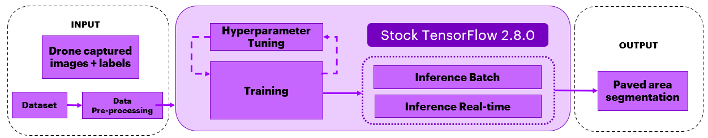
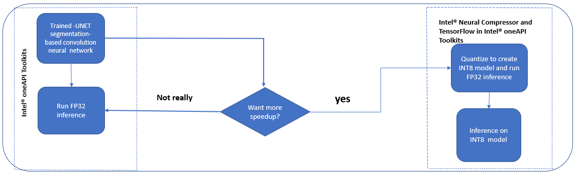
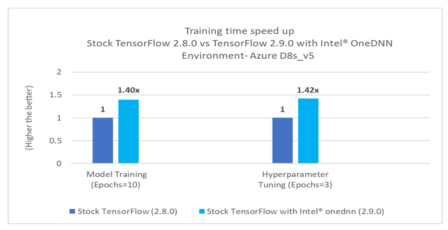
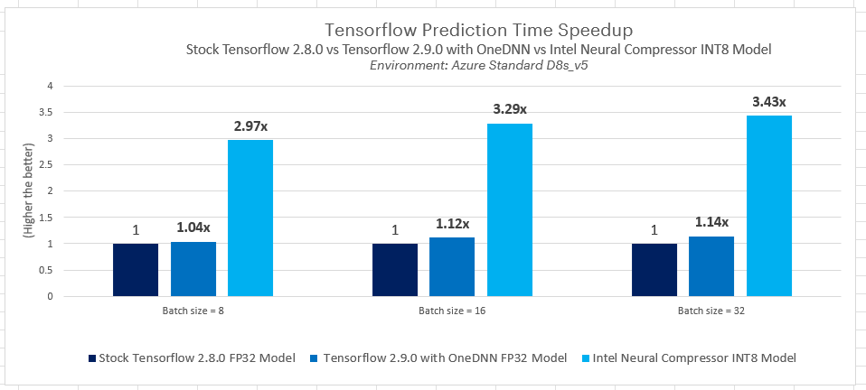

# Applications of AI in Drone Technology Using TensorFlow
## Table of Contents 
 - [Purpose](#purpose)
 - [Reference Solution](#reference-solution)
 - [Reference Implementation](#reference-implementation)
 - [Intel® Optimized Implementation](#optimizing-the-end-to-end-solution-with-intel%C2%AE-oneapi-components)
 - [Performance Observations](#performance-observations)

## Purpose
Drones are unmanned aerial vehicles (UAVs) or unmanned aircraft systems. Essentially, a drone is a flying robot that can be remotely controlled using remote control devices which communicate with the drone. While drones have huge applications in urban development, construction & infrastructure, supply chain, logistics use cases etc. safety is a huge concern.

Drones are used commercially as first-aid vehicles, as tools for investigation by police departments, in high-tech photography and as recording devices for real estate properties, concerts, sporting events etc. This reference kit model has been built with the objective of improving the safety of autonomous drone flight and landing procedures at the edge (which runs on CPU based hardware) without ground-based controllers or human pilots onsite.

Drones at construction sites are used to scan, record, and map locations or buildings land surveys, tracking machines, remote monitoring, construction site security, building inspection, and worker safety. However, drone crashes are dangerous and can lead to devastation.

In utilities sector, inspecting growing numbers of towers, powerlines, and wind turbines is difficult and creates prime opportunities for drones to replace human inspection with accurate image-based inspection and diagnosis. Drones transform the way inspection and maintenance personnel do their jobs at utility companies. If a drone meets with an accident while landing, it could damage assets and injure personnel.

Safe landing of drones without injuring people or damaging property is vital for massive adoption of drones in day-to-day life. Considering the risks associated with drone landing, paved areas dedicated for drones to land are considered safe. The AI model created leveraging Intel oneAPI segments paved areas for safe landing.

The use of AI in the context of drones can be further optimized using Intel® oneAPI which improves the performance of computing intensive image processing, reduces training time and inferencing time and scales the usage of complex models by compressing models to run efficiently on Edge devices. Intel® oneDNN optimized TensorFlow provides additional optimizations for an extra performance boost on Intel® CPU.

## Reference Solution  
This reference kit leverages Intel® oneAPI to demonstrate one-way Applications of TensorFlow based AI Model that works on Drone Technology and the AI models developed to help to segment paved areas which increases the probability of landing drones safely.

The experiment focus is drone navigation for inspections. Therefore, the experiment aims to segment the paved area and different objects around the drone path in order to land the drone safely on the paved area. The goal is therefore to take an image captured by the drone camera as input and pass it through the Semantic Segmentation Model (VGG-UNET architecture) to accurately recognize entities i.e. paved area, people, vehicles, dogs etc. to then benchmark speed and accuracy of training, inference both (batch and real-time) against Intel’s technology.
When it comes to the deployment of this model on Edge devices with less computing and memory resources such as drones itself, model is quantized and compressed while bringing out the same level of accuracy and efficient utilization of underlying computing resources. Model optimization and compression is done using Intel's INC .
This reference kit is implemented using Tensorflow 2.8.0 for stock and Tensorflow 2.9.0 with oneDNN in the Intel® environment.

## Key Implementation Details
- The framework we used here for building the model which works on Drone technology is TensorFlow. In this reference kit, we highlight the difference of using Intel® oneAPI AI Analytics Toolkit against the stock versions.
- In this reference kit Computer vision based a VGG-UNET model has been built  which is able to segment the paved area for safe landing of Drone. The model training time, inference time and the accuracy of the model are captured for multiple runs on the stock version as well on the Intel OneAPI version. The average of these runs are considered and the comparison have been provided.
- Model has been quantized using Intel® Neural Compressor which has shown high performance vectorized operations on Intel® platforms.


## Reference Implementation
### Use Case End-To-End flow


### Expected Input-Output

**Input**                                 | **Output** |
| :---: | :---: |
| Imaged data (20 classes)                |  Paved Area Segmentation


### Reference Sources

*DataSet*: https://www.kaggle.com/datasets/bulentsiyah/semantic-drone-dataset (4 GB dataset for this use case)<br>
*Case Study & Repo*: https://www.kaggle.com/code/bulentsiyah/deep-learning-based-semantic-segmentation-keras/notebook 

> ***Please see this data set's applicable license for terms and conditions. Intel®Corporation does not own the rights to this data set and does not confer any rights to it.***

### Repository clone and Anaconda installation

```
git clone https://github.com/oneapi-src/drone-navigation-inspection
cd drone-navigation-inspection
```

> In this reference kit implementation already provides the necessary conda environment configurations to setup the software requirements. To utilize these environment scripts, first install Anaconda/Miniconda by following the instructions at the following link<br>[Anaconda installation](https://docs.anaconda.com/anaconda/install/linux/)

### Usage and Instructions

Below are the steps to reproduce the benchmarking results given in this repository
1. Creating the execution environment
2. Dataset preparation
3. Training VGG-UNET model
4. Model Inference
5. Quantize trained models using Intel® Neural Compressor and benchmarking
6. Observations


### Software Requirements
| **Package**                | **Stock Python**                   
| :---                       | :---                               
| Python                     | Python=3.9.7                       
| TensorFlow                 | TensorFlow==2.8.0                 
| Intel® Neural Compressor   | *NA*                               


### Environment
Below are the developer environment used for this module on Azure. All the observations captured are based on these environment setup.

| **Size** | **CPU Cores** | **Memory**  | **Intel® CPU Family**
| :--- | :--: | :--: | :--:
| *Standard_D8_Vs5* | 8 | 32GB | ICELAKE

### Solution setup
The below file is used to create an environment as follows:

**YAML file**                                 | **Environment Name** |  **Configuration** |
| :---: | :---: | :---: |
| `env/stock/drone-stock.yml`             | `drone-stock` | Python=3.9.7 with stock TensorFlow 2.8.0

### Dataset
Pixel-accurate annotation for Drone Dataset focuses on semantic understanding of urban scenes for increasing the safety of Drone landing procedures. The imagery depicts more than 20 houses from nadir (bird's eye) view acquired at an altitude of 5 to 30 meters above ground. A high resolution camera was used to acquire images at a size of 6000x4000px (24Mpx). The complexity of the dataset is limited to 20 classes and the target output is paved area class. The training set contains 320  publicly available images, and the test set is made up of 80 images. Here the train & test dataset split is 80:20.

| **Use case** | Paved Area Segmentation
| :--- | :---
| **Object of interest** | Paved Area 
| **Size** | Total 400 Labelled Images<br>
| **Train : Test Split** | 80:20
| **Source** | https://www.kaggle.com/datasets/bulentsiyah/semantic-drone-dataset

> **Note**: Please refer to the  data.txt file in the data folder for downloading the dataset.

### Training
VGG-UNET is a segmentation based convolutional neural network , a segmentation architecture to segment the Paved Area and other classes from the environment.
Stock TensorFlow v2.8.0 is used for transfer learning the VGG-UNET segmentation architecture on the semantic drone dataset which has been downloaded and been preprocessed using OpenCV & NumPy .

> **Note**: If any issues regarding CV2 dependency comes like "cv2 import *ImportError: libGL.so.1: cannot open shared object file" or "libgthread-2.0.so.0: cannot open shared object file: No such file or directory" please refer to the known issues section.


| **Input Image Dimension** | 416x608 (preprocessed data)
| :--- | :---
| **Output Model format** | TensorFlow checkpoint
  **Output**  | Paved area segmentation


### Inference
Performed inferencing on the trained model using Stock TensorFlow v2.8.0.

#### 1. Environment Creation
**Setting up the environment for Stock TensorFlow**<br>Follow the below conda installation commands to setup the Stock TensorFlow environment for the model training and prediction. 
```sh
conda env create -f env/stock/drone-stock.yml
```
*Activate stock conda environment*
Use the following command to activate the environment that was created:
```sh
conda activate drone-stock

```

#### 2. Data preparation
> The Aerial Semantic Segmentation Drone Dataset is downloaded and extracted in a folder before running the training python module.

Folder structure Looks as below after extraction of dataset.
```
- Aerial_Semantic_Segmentation_Drone_Dataset
    - dataset
        - semantic_drone_dataset
            - label_images_semantic
            - original_images
    - RGB_color_image_masks
```
> **Note**: For instructions to download the dataset, refer the data.txt file inside the data folder.

> **Now the data folder contains the below structure** 
<br>data="data/Aerial_Semantic_Segmentation_Drone_Dataset/dataset/semantic_drone_dataset/"

#### 3. Training VGG-UNET model
Run the training module as given below to start training and prediction on validation dataset (a sample of data held back from training your model that is used to give an estimate of model skill) using the active environment. 

<br>This module takes option to run the training.
```
usage: training.py [-h] [-m MODEL_PATH] [-d DATA_PATH] [-e EPOCHS] [-hy HYPERPARAMS] [-o OUTPATH]

optional arguments:
  -h, --help            show this help message and exit
  -m MODEL_PATH, --model_path MODEL_PATH
                        Please provide the Latest Checkpoint path e.g for "./vgg-unet.1"...Default is None
  -d DATA_PATH, --data_path DATA_PATH
                        Absolute path to the dataset folder containing "original_images" and "label_images_semantic" folders
  -e EPOCHS, --epochs EPOCHS
                        provide the number of epochs want to train
  -hy HYPERPARAMS, --hyperparams HYPERPARAMS
                        enable the hyperparameters for tuning...Default is "0"
  -o OUTPATH, --outpath OUTPATH
                        use 1 to save Intel Model by creating intel folder in model path, for  stock  0

```

**Command to run training**
> **Note**:Make sure that you are running this command from 'src' folder
```sh
cd src
python training.py -d ../data/Aerial_Semantic_Segmentation_Drone_Dataset/dataset/semantic_drone_dataset   -e 10  -m ./model -o 0

```

**Expected Output**<br>
The output trained model will be saved in TensorFlow checkpoint format in model/stock folder in the current directory once training will get completed as shown in below .Training time in seconds would be generated at the end of the training script.

```
model/
└------- stock
    ├    ├── vgg_unet_config.json
    │    ├── vgg_unet.index
    │    ├── vgg_unet.data-00000-of-00001
    |    ├── checkpoint
    │  
    │
    └-----intel
```      
### Hyperparameter_tuning

Transfer learning was performed as part of default training with the best possible parameters led to considerable drop in Categorial cross-entropy loss.Later trained models are used as a starting point for hyperparameter tuning to boost performance. The parameter search space is confined to the few parameters listed below, however users can utilize this reference implementation to improve the model's performance

**Command to run Hyperparameter tuning**
> **Note**:Make sure that you are running this command from 'src' folder
```sh
python training.py -d ../data/Aerial_Semantic_Segmentation_Drone_Dataset/dataset/semantic_drone_dataset -e 3 -m ./model -hy 1 -o 0
```
```
** Hyperparameters used here are as below **
Dataset remains same with 80:20 split for Training and testing.
batchsize = 4, epochs = 3, steps per epoch = 128

"learning rates"      : [0.001, 0.01, 0.0001]
"optimizers"          : ["Adam", "adadelta", "rmsprop"]
"loss"                : ["categorical_crossentropy"]
```

> We recommend to use the model trained using regular training module as starting point for Hyperparameter tuning. So that one can identify the best possible combinations to get the better accuracy.<br>

> **Note**: **The best combinations of  Hyperparameter tuning will get printed end of the script . The model can be retrained for a longer time (more number of epochs)  with the best combination of Hyperparameters to achieve a better accuracy.**


**Convert the model to frozen graph**

Run the conversion module to convert the TensorFlow checkpoint model format to frozen graph format. This frozen graph can be later used for Inferencing, Intel® Neural Compressor .
```
usage: create_frozen_graph.py [-h] [-m MODEL_PATH] -o OUTPUT_SAVED_DIR

optional arguments:
  -h, --help            show this help message and exit
  -m MODEL_PATH, --model_path MODEL_PATH
                        Please provide the Latest Checkpoint path e.g for "./vgg-unet.1"...Default is None
  -o OUTPUT_SAVED_DIR, --output_saved_dir OUTPUT_SAVED_DIR
                        directory to save frozen graph to.

```

**Command to run conversion**
> **Note**:Make sure that you are running this command from 'src' folder 
```sh
 python create_frozen_graph.py -m ./model/stock/vgg_unet --output_saved_dir ./model/stock
```
> Above conversion script will save "frozen_graph.pb" in "./model/stock" folder in current directory.
  

#### 4. Inference
*Running inference using TensorFlow frozen graph*

```
usage: run_inference.py [-h] [-m MODELPATH] [-d DATA_PATH] [-b BATCHSIZE]

optional arguments:
  -h, --help            show this help message and exit
  -m MODELPATH, --modelpath MODELPATH
                        provide frozen Model path ".pb" file...users can also
                        use Intel® Neural Compressor INT8 quantized model here
  -d DATA_PATH, --data_path DATA_PATH
                        Absolute path to the dataset folder containing
                        "original_images" and "label_images_semantic" folders
  -b BATCHSIZE, --batchsize BATCHSIZE
                        batchsize used for inference
```
**Command to run inference**

> **Note**:Make sure that you are running this command from 'src' folder

```sh
python run_inference.py -m ./model/stock/frozen_graph.pb -d ../data/Aerial_Semantic_Segmentation_Drone_Dataset/dataset/semantic_drone_dataset -b 1
```
> Above inference script can be run using different batch sizes<br>

**Evaluating the model on Test Dataset**

Run the evaluation module to find out the class wise accuracy score.
```
usage: evaluation.py [-h] [-m MODEL_PATH] [-d DATA_PATH] [-t MODEL_TYPE]

optional arguments:
  -h, --help            show this help message and exit
  -m MODEL_PATH, --model_path MODEL_PATH
                        Please provide the Latest Checkpoint path e.g for "./vgg-unet.1"...Default is None
  -d DATA_PATH, --data_path DATA_PATH
                        Absolute path to the dataset folder containing "original_images" and "label_images_semantic" folders
  -t MODEL_TYPE, --model_type MODEL_TYPE
                        0 for checkpoint 1 for frozen_graph
```

**Command to run evaluation**
> **Note**:Make sure that you are running this command from 'src' folder

```sh

 python evaluation.py -d ../data/Aerial_Semantic_Segmentation_Drone_Dataset/dataset/semantic_drone_dataset -m ./model/stock/vgg_unet -t 0
                                                   or
 python evaluation.py -d ../data/Aerial_Semantic_Segmentation_Drone_Dataset/dataset/semantic_drone_dataset -m ./model/stock/frozen_graph.pb  -t 1
```

## Optimizing the End To End solution with Intel® oneAPI components
### Use Case End-To-End flow


### Optimized software requirements

| **Package**                | **Intel® Python**                   
| :---                       | :---                               
| Python                     | Python=3.9.7
| TensorFlow                 | TensorFlow==2.9.0
| Intel® Neural Compressor  | Intel® Neural Compressor==1.12
 

**YAML file**                                 | **Environment Name** |  **Configuration** |
| :---: | :---: | :---: |
`env/intel/drone-intel.yml`             | `drone-intel` | Python=3.9.7 with Intel® TensorFlow 2.9.0 |


### Training

VGG-UNET is a segmentation based convolutional neural network ,a segmentation architecture to segment the Paved Area and other classes from the environment.
Intel® oneDNN optimized TensorFlow v2.9.0 is used for transfer learning the VGG-UNET segmentation architecture on the semantic drone dataset which has been downloaded and been preprocessed using OpenCV & NumPy .

| **Input Image Dimension** | 416x608 (preprocessed data)
| :--- | :---
| **Output Model format** | TensorFlow checkpoint
  **Output**  | Paved area segmentation

### Inference

Performed inferencing on the trained model using
- Intel® oneDNN optimized TensorFlow v2.9.0
- Intel® Neural Compressor


#### 1. Environment Creation

**Before setting up the Intel environment please deactivate existing Stock environment by executing below and navigate to cd <installation directory> **
```sh
cd <installation directory>
conda deactivate 
``` 

**Setting up the environment for Intel® oneDNN optimized TensorFlow**<br>Follow the below conda installation commands to setup the Intel® oneDNN optimized TensorFlow environment for the model training and prediction.
```sh
cd <installation directory>
conda env create -f env/intel/drone-intel.yml
```
**Note**:  If any issues regarding installation of pycocotools or gcc dependency appear, refer to the known issues section.

**Activate intel conda environment**
<br>Use the following command to activate the environment that was created:
```sh
conda activate drone-intel
export TF_ENABLE_ONEDNN_OPTS=1
```
**Intel® oneDNN optimized TensorFlow v2.9.0**

Enable the Intel® oneDNN flag to incorporate below Intel® oneDNN optimized Tensorflow optimizations.
```
export TF_ENABLE_ONEDNN_OPTS=1
```
#### 2. Data preparation

Data download is automated with the scripts mentioned in data.txt file in data folder
The same has been already discussed in detail in data preparation section for Stock. The data needs to be downloaded one file at a time before executing the experiment.

#### 3. Training VGG-UNET model

Run the training module as given below to start training and prediction using the active environment.

This module takes option to run the training.
```
usage: training.py [-h] [-m MODEL_PATH] [-d DATA_PATH] [-e EPOCHS] [-hy HYPERPARAMS] [-o OUTPATH]

optional arguments:
  -h, --help            show this help message and exit
  -m MODEL_PATH, --model_path MODEL_PATH
                        Please provide the Latest Checkpoint path e.g for "./vgg-unet.1"...Default is None
  -d DATA_PATH, --data_path DATA_PATH
                        Absolute path to the dataset folder containing "original_images" and "label_images_semantic" folders
  -e EPOCHS, --epochs EPOCHS
                        provide the number of epochs want to train
  -hy HYPERPARAMS, --hyperparams HYPERPARAMS
                        enable the hyperparameters for tuning...Default is "0"
  -o OUTPATH, --outpath OUTPATH
                        use 1 to save Intel Model by creating intel folder in model path, for stock 0

```
**Command to run training**

> **Note**:Make sure that you are running this command from 'src' folder 

```sh
python training.py -d ../data/Aerial_Semantic_Segmentation_Drone_Dataset/dataset/semantic_drone_dataset   -e 10  -m ./model -o 1

```
**Expected Output**<br>
The output trained model will be saved in TensorFlow checkpoint format in model/intel folder in the current directory once training will get completed as shown in below .Training time in seconds would be generated at the end of the training script.

```
model/
└------- stock
    ├    
    │  
    │
    └----intel
             ├── vgg_unet_config.json
             ├── vgg_unet.index
             ├── vgg_unet.data-00000-of-00001
             ├── checkpoint
```
### Hyperparameter_tuning

Transfer learning was performed as part of default training with the best possible parameters led to considerable drop in Categorial cross-entropy loss.Later trained models are used as a starting point for hyperparameter tuning to boost performance. The parameter search space is confined to the few parameters listed below, however users can utilize this reference implementation to improve the model's performance

**Command to run Hyperparameter tuning**

> **Note**:Make sure that you are running this command from 'src' folder 

```sh
python training.py -d ../data/Aerial_Semantic_Segmentation_Drone_Dataset/dataset/semantic_drone_dataset -e 3 -m ./model -hy 1 -o 1
```
```
Hyperparameters used here are as below
Dataset remains same with 80:20 split for Training and testing.
batchsize = 4, epochs = 3, steps per epoch = 128

"learning rates"      : [0.001, 0.01, 0.0001]
"optimizers"          : ["Adam", "adadelta", "rmsprop"]
"loss"                : ["categorical_crossentropy"]
```

>We recommend to use the model trained using regular training module as starting point for Hyperparameter tuning. So that one can identify the best possible combinations to get the better accuracy.<br>

> **Note**: **The best combinations of  Hyperparameter tuning will get printed end of the script . The model can be retrained for a longer time (more nuber of epochs)  with the best combination of Hyperparameters to achieve a better accuracy.**


**Convert the model to frozen graph**

Run the conversion module to convert the TensorFlow checkpoint model format to frozen graph format. This frozen graph can be later used for Inferencing, Intel® Neural Compressor .
```
usage: create_frozen_graph.py [-h] [-m MODEL_PATH] -o OUTPUT_SAVED_DIR

optional arguments:
  -h, --help            show this help message and exit
  -m MODEL_PATH, --model_path MODEL_PATH
                        Please provide the Latest Checkpoint path e.g for "./vgg-unet.1"...Default is None
  -o OUTPUT_SAVED_DIR, --output_saved_dir OUTPUT_SAVED_DIR
                        directory to save frozen graph to.

```

**Command to run conversion**
> **Note**:Make sure that you are running this command from 'src' folder 
```sh
 python create_frozen_graph.py -m ./model/intel/vgg_unet --output_saved_dir ./model/intel
```
> Above conversion script will save "frozen_graph.pb" in "./model/intel" folder in current directory.

#### 4. Inference
Running inference using TensorFlow frozen graph

```
usage:run_inference.py [-h] [-m MODELPATH] [-d DATA_PATH] [-b BATCHSIZE]

optional arguments:
  -h, --help            show this help message and exit
  -m MODELPATH, --modelpath MODELPATH
                        provide frozen Model path ".pb" file...users can also
                        use Intel® Neural Compressor INT8 quantized model here
  -d DATA_PATH, --data_path DATA_PATH
                        Absolute path to the dataset folder containing
                        "original_images" and "label_images_semantic" folders
  -b BATCHSIZE, --batchsize BATCHSIZE
                        batchsize used for inference
```
**Command to run inference**
> **Note**:Make sure that you are running this command from 'src' folder 

```sh
python run_inference.py -m ./model/intel/frozen_graph.pb -d ../data/Aerial_Semantic_Segmentation_Drone_Dataset/dataset/semantic_drone_dataset -b 1
```
> Above inference script can be run in Intel® environment using different batch sizes<br>
Same script can be used to benchmark Intel® Neural Compressor INT8 Quantized model. For more details please refer to Intel® Neural Compressor quantization section.<br>
By using different batchsize one can observe the gain obtained using Intel® oneDNN optimized Tensorflow in Intel® environment.<br>
Run this script to record multiple trials and the average can be calculated.

**Evaluating the model on Test Dataset**

Run the evaluation module to find out the class wise accuracy score.
```
usage: evaluation.py [-h] [-m MODEL_PATH] [-d DATA_PATH] [-t MODEL_TYPE]

optional arguments:
  -h, --help            show this help message and exit
  -m MODEL_PATH, --model_path MODEL_PATH
                        Please provide the Latest Checkpoint path e.g for "./vgg-unet.1"...Default is None
  -d DATA_PATH, --data_path DATA_PATH
                        Absolute path to the dataset folder containing "original_images" and "label_images_semantic" folders
  -t MODEL_TYPE, --model_type MODEL_TYPE
                        0 for checkpoint 1 for frozen_graph

```
> **Note**:Make sure that you are running this command from 'src' folder 

**Command to run evaluation**
```sh
  python evaluation.py -d ../data/Aerial_Semantic_Segmentation_Drone_Dataset/dataset/semantic_drone_dataset -m ./model/intel/vgg_unet -t 0                         
                                                or
  python evaluation.py -d ../data/Aerial_Semantic_Segmentation_Drone_Dataset/dataset/semantic_drone_dataset -m ./model/intel/frozen_graph.pb  -t 1

```
> Same script can be used for Evaluating Intel® Neural Compressor INT8 Quantized model. For more details please refer to Intel® Neural Compressor quantization section.<br>


#### 5. Quantize trained models using Intel® Neural Compressor
Intel® Neural Compressor is used to quantize the FP32 Model to the INT8 Model. Optimized model is used here for evaluating and timing Analysis.
Intel® Neural Compressor supports many optimization methods. In this case, we used post training quantization  method to quantize the FP32 model .

*Step-1: Conversion of FP32 Model to INT8 Model*

```
usage: neural_compressor_conversion.py [-h] [-m MODELPATH] [-o OUTPATH] [-c CONFIG] [-d DATA_PATH] [-b BATCHSIZE]

optional arguments:
  -h, --help            show this help message and exit
  -m MODELPATH, --modelpath MODELPATH
                        Model path trained with TensorFlow ".pb" file
  -o OUTPATH, --outpath OUTPATH
                        default output quantized model will be save in ./inc_compressed_model/output.pb
  -c CONFIG, --config CONFIG
                        Yaml file for quantizing model, default is "./deploy.yaml"
  -d DATA_PATH, --data_path DATA_PATH
                        Absolute path to the dataset folder containing "original_images" and "label_images_semantic"
                        folders
  -b BATCHSIZE, --batchsize BATCHSIZE
                        batchsize for the dataloader....default is 1
```

**Command to run the neural_compressor_conversion**

**Note**:Activate Intel® Environment before running & Make sure that you are running this command from 'src/intel_neural_compressor' folder 
```sh
cd src/intel_neural_compressor
python neural_compressor_conversion.py -d ../../data/Aerial_Semantic_Segmentation_Drone_Dataset/dataset/semantic_drone_dataset -m  ../model/intel/frozen_graph.pb -o  ../model/inc_compressed_model/output

```
> Quantized model will be saved by default in `../model/inc_compressed_model` folder as `output.pb`


*Step-2: Inferencing using quantized Model*
```
usage: run_inference.py [-h] [-m MODELPATH] [-d DATA_PATH] [-b BATCHSIZE]

optional arguments:
  -h, --help            show this help message and exit
  -m MODELPATH, --modelpath MODELPATH
                        provide frozen Model path ".pb" file...users can also
                        use Intel® Neural Compressor INT8 quantized model here
  -d DATA_PATH, --data_path DATA_PATH
                        Absolute path to the dataset folder containing
                        "original_images" and "label_images_semantic" folders
  -b BATCHSIZE, --batchsize BATCHSIZE
                        batchsize used for inference
```
*Command to run inference for realtime `(batchsize =1)`*
```sh
cd <installation directory>/src
 python run_inference.py -m ./model/inc_compressed_model/output.pb -d ../data/Aerial_Semantic_Segmentation_Drone_Dataset/dataset/semantic_drone_dataset  -b 1
```
> Use `-b` to test with different batch size (e.g. `-b 10`)

*Step-3: Evaluating quantized Model*

```
usage: evaluation.py [-h] [-m MODEL_PATH] [-d DATA_PATH] [-t MODEL_TYPE]

optional arguments:
  -h, --help            show this help message and exit
  -m MODEL_PATH, --model_path MODEL_PATH
                        Please provide the Latest Checkpoint path e.g for "./vgg-unet.1"...Default is None
  -d DATA_PATH, --data_path DATA_PATH
                        Absolute path to the dataset folder containing "original_images" and "label_images_semantic" folders
  -t MODEL_TYPE, --model_type MODEL_TYPE
                        0 for checkpoint 1 for frozen_graph

```
> **Note**:Make sure that you are running this command from 'src' folder 

**Command to run evaluation**
```sh

python evaluation.py -d ../data/Aerial_Semantic_Segmentation_Drone_Dataset/dataset/semantic_drone_dataset -m ./model/inc_compressed_model/output.pb  -t 1
```


## Performance Observations

This section covers the training time and inference time comparison between Stock TensorFlow 2.8.0 and  Intel®oneDNN optimized TensorFlow 2.9.0 for this model building.

### Training and Hyperparameter_tuning  benchmarking results




<br>**Key Takeaways**<br>
TensorFlow 2.9.0 with Intel® oneDNN offers speed up of training time up to 1.4x during regular model training and up to 1.42x speed up during hyperparameter tuned training, as compared to the Stock TensorFlow 2.8.0.

### Inference benchmarking results Stock TensorFlow 2.8.0 FP32 Model vs TensorFlow 2.9.0 with OneDNN FP32 Model vs Intel® Neural Compressor INT8 Model.




<br>**Key Takeaways**<br>

-  Batch prediction time speedup with TensorFlow 2.9.0  with oneDNN FP32 Model shows up to 1.14x against stock TensorFlow 2.8.0 FP32 Model
-  Intel® Neural Compressor quantization offers batch prediction time speedup  up to 3.43x against stock TensorFlow 2.8.0  FP32  model  . At larger batch size, stock Tensorflow 2.8.0 was unable to complete without errors.
-  Accuracy drop of only 0.001% is observed post quantization of FP32 model in both phases.
-  Model Footprint is reduced from 47 MB to 12 MB (~75% Compressed)


## Conclusion
To build a **paved area segmentation model** for Drone landing , Machine learning developers will need to train models for substantial datasets and run inference more frequently. The ability to accelerate training will allow them to train more frequently and achieve better accuracy. Besides training, faster speed in inference will allow them to run prediction in real-time scenarios as well as more frequently. This reference kit implementation provides performance-optimized guide around paved area segmentation model for Drone safe landing ,use cases that can be easily scaled across similar use cases.

### Notices & Disclaimers
Performance varies by use, configuration and other factors. Learn more on the [Performance Index site](https://edc.intel.com/content/www/us/en/products/performance/benchmarks/overview/). 
Performance results are based on testing as of dates shown in configurations and may not reflect all publicly available updates.  See backup for configuration details.  No product or component can be absolutely secure. 
Your costs and results may vary. 
Intel technologies may require enabled hardware, software or service activation.<br>
© Intel Corporation.  Intel, the Intel logo, and other Intel marks are trademarks of Intel Corporation or its subsidiaries.  Other names and brands may be claimed as the property of others.  

To the extent that any public or non-Intel datasets or models are referenced by or accessed using tools or code on this site those datasets or models are provided by the third party indicated as the content source. Intel does not create the content and does not warrant its accuracy or quality. By accessing the public content, or using materials trained on or with such content, you agree to the terms associated with that content and that your use complies with the applicable license.
 
Intel expressly disclaims the accuracy, adequacy, or completeness of any such public content, and is not liable for any errors, omissions, or defects in the content, or for any reliance on the content. Intel is not liable for any liability or damages relating to your use of public content.


## Appendix

### **Experiment setup**
- Testing performed on: December 2022
- Testing performed by: Intel Corporation
- Configuration Details: Azure Standard_D8_Vs5 (Intel(R) Xeon(R) Platinum 8370C CPU @ 2.80GHz), 1 Socket, 4 Cores per Socket, 2 Threads per Core, Turbo:On, Total Memory: 32 GB, OS: Ubuntu 20.04, Kernel: Linux 5.13.0-1031-azure , Software: Tensorflow 2.9, Tensorflow 2.8, Intel® Neural Compressor 1.12 


| **Optimized for**:                | **Description**
| :---                              | :---
| Platform                          | Azure Standard D8v5 : Intel Xeon Platinum 8370C (Ice Lake) @ 2.80GHz, 4 vCPU, 32GB memory
| OS                                | Ubuntu 20.04
| Hardware                          | CPU
| Software                          | Intel® oneAPI Optimizations for Tensorflow v2.9.0, Intel® Neural Compressor v1.12 
| What you will learn               | Intel® oneAPI performance advantage over the stock versions

### Known Issues

1. Environment Creation Issue : Could not build wheels for pycocotools

    **Issue:**
      When creating an intel environment using `drone-intel` 
      ```
      ERROR: Could not build wheels for pycocotools, which is required to install pyproject.toml-based projects
      ```

    **Solution:**

    Install gcc.  For Ubuntu, this will be: 

      ```bash
      apt install gcc
      ```

2. ImportError: libGL.so.1: cannot open shared object file: No such file or directory
   
    **Issue:**
      When training the model using `training.py`,
      ```
      ImportError: libGL.so.1: cannot open shared object file: No such file or directory
      or
      libgthread-2.0.so.0: cannot open shared object file: No such file or directory
      ```

    **Solution:**

      Install the libgl11-mesa-glx and libglib2.0-0 libraries. For Ubuntu this will be:

      ```bash
     sudo apt install libgl1-mesa-glx
     sudo apt install libglib2.0-0
      ```


